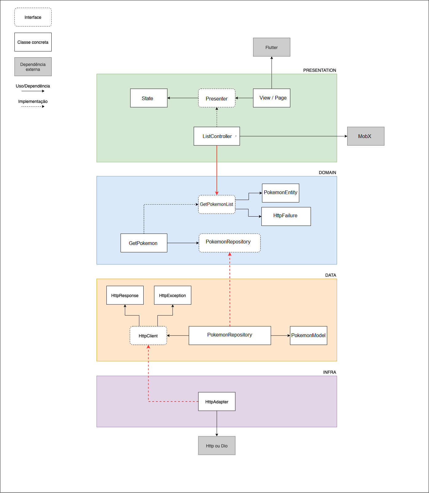

# Guia de Motéis GO - Desafio técnico

[Voltar](/README.md)


Projeto GO, criado com o conceito de Micro Apps.

O projeto está organizado na seguinte estrutura:

- **base_app:** Responsável por executar a aplicação. Único que conhece todos os Micro Apps da aplicação.
- **dependencies:** Mantém centralizadas todas as dependências dos Micro Apps.
- **core:** Mantém tudo que é do núcle compartilhável entre os Micro Apps (Widgets, mixins, entities, infra, etc).
- _packages:_ Os demais packages de uso global que possuem o nome indicando uma feature são Micro Apps. Devem ser seguidas algumas regras desse tipo de package:
  1. Um Micro App **nunca** deve referenciar outro Micro App (Se a lógica for compartilhada deve utilizar o conceito de _dependencies_)
  2. Seguir em todos os Micro Apps a mesma arquitetura e estrutura de pastas, inclusive nos testes
  3. Não adicionar dependências externas nesses packages (Sempre adicionar no package dependencies), salvo pacote muito específco para uma feature.
- _features:_ Packages de uso específico para o projeto. Devem ser seguidas algumas regras desse tipo de package:
  1. Um Micro App **nunca** deve referenciar outro Micro App (Se a lógica for compartilhada deve utilizar o conceito de _EventBus_)
  2. Seguir em todos os Micro Apps a mesma arquitetura e estrutura de pastas, inclusive nos testes
  3. Não adicionar dependências externas nesses packages (Sempre adicionar no package dependencies), salvo pacote muito específco para uma feature.

Abaixo seguem informações sobre a estrutura do projeto, setup e outras considerações.

## **1. Arquitetura do projeto**

O projeto é dividido em packages, onde cada package implementa um Micro App, que segue a Clean Architecture.


Estrutura básica de pastas para os Micro Apps. Pode variar de acordo com a necessidade. Esta estrutura deve ser espelhada nos testes:

```yaml
/lib
/domain
/interfaces
/entities
/usecases
/errors
/data
/interfaces
/repositories
/infrastructure
/presentation
/interfaces
/presenters
/views
/components
/validations
/internationalization
<main>.dart
```

### 1.1 Camadas

#### **Domain**

Essa camada é o core do Microapp. É onde são implementadas as entities e usecases, contendo, respetivamente, as regras de negócio corporativas e regras de negócio da aplicação.

Nessa camada estarão definidas as ‘interfaces’ da camada data. Ocasionalmente existirão também algumas ‘interfaces’ da
camada infrastructure, como Navigation e DependencyManager.

Deve-se ter muito cuidado ao trabalhar nessa camada... Ela deve ter o mínimo de dependências externas possível. Quando
necessário adicionar algum package externo aqui, devem ser tomadas certas precauções, como:

- verificar o **real benefício** da sua utilização
- verificar o número de contribuintes desse package
- verificar se recebe atualizações constantemente
- verificar a sua popularidade/likes no pub.dev

#### **Data**

Na camada Data serão realizadas as chamadas a datasources locais ou externos e o tratamento dos dados de envio/recebimento por meio dos Repositories.

O tratamento dos dados, quando necessário, deve ser feito em classes "Model" específicas. Essas classes devem saber as características dos dados sendo enviados ou recebidos (parse de JSON, parse de Model para Entity e vice-versa).

A comunicação com datasources externos/locais não será feita diretamente. Deve ser por ‘interface’ adapters. A implementação dessa ‘interface’ (HttpClient, por exemplo) será recebida no repository através do seu constructor.

A definição dessas ‘interfaces’ adapters será localizada na própria camada data, por se tratar de uma dependência para a sua execução. A sua implementação, no entando, deve ser feita em outra camada.

#### **Infrastructure**

Essa camada serve para isolar completamente o App de packages externos e suas particularidades. Internamente, o app trabalhará apenas com dados/classes locais, conhecidas por ele. Com a correta utilização dessa camada, se for necessário substituir um package por outro, o impacto tende a ser mínimo.

Como exemplo podemos pegar o caso comentado acima, onde os repositories da camada Data receberão as implementações de interface adapters. Esses adapters, como o nome já diz, adaptam uma classe externa para ser utilizada seguindo um padrão pré-definido no próprio App.

Podemos usar a comunicação HTTP como exemplo:

- Interface HttpClient:
  - Define como a comunicação deve ocorrer (métodos get, post, etc)
  - Define os tipos de retorno e exceptions lançadas, exemplo: HttpResponse e HttpError.
- Adapter da HttpClient - Implementação utilizando package Dio:
  - Define uma implementação da interface HttpClient, utilizando internamente o Dio.
  - Trata internamente as respostas de sucesso e erro do Dio e as converte para os tipos conhecidos: HttpResponse e HttpError.
  - Dessa forma, o Dio e suas particularidades não serão conhecidos e utilizados diretamente.

#### **Presentation**

Essa camada é responsável por tudo que tange a parte visual do App.

Nessa camada são definidos basicamente:

- Interfaces:
  - Contratos para a criação dos presenters e seus dados (state)
- Presenters/UI:
  - Controlam o fluxo de dados da uma ou mais views
  - São implementados utilizando algum package externo, como Cubit/Bloc, MobX.
- Views/Components:
  - UI/componentes criados com Flutter
- Internationalization:
  - Classes para aplicação de i18n (TODO)

#### **Main**

Essa camada está representada na estrutura acima como o arquivo `<main>.dart`. Nesse arquivo é feita toda a composição dos módulos/Micro Apps.

Isso significa que a camada Main conhece todas as outras camadas e será a responsável por montar toda a estrutura necessária para executar o Micro App. É essa camada que, por exemplo, fará a instanciação dos usecases e os injetará nos presenters.

Nesse projeto, essa camada é montada com a utilização do package flutter_modular.

Normalmente esse arquivo receberá o nome do Micro App que ele representa, por exemplo, para o Micro App de Onboarding existirá um arquivo `onboarding.dart` na pasta raiz do App.

### 1.2 Comunicação entre camadas

Segue abaixo um diagrama que visa mostrar como ocorre a comunicação entre as camadas. Ele exemplifica a implementação de uma feature de autenticação.

Imagine que a ação inicial ocorre na LoginPage, ao usuário informar seu e-mail e senha... Todo fluxo segue a partir daí.

Perceba as linhas destacadas em vermelho que cruzam as camadas: Essas linhas sempre indicam a direção central (Seguem em direção ao Domain) e são ligadas através de interfaces e suas implementações.

A interface que é definida em uma camada, acaba sendo implementada em outra, onde faz mais sentido.



### 1.3 Adicionando Micro Apps

Um Micro App pode ser adicionado através do comando:

```bash
flutter create -t package home
```

As únicas dependências que o Micro App pode ter são:

- local package: core
- local package: dependencies
- dev_dependencies

Exemplo:

```yaml
dependencies:
  core:
    path: ../core
  dependencies:
    path: ../dependencies

dev_dependencies:
  flutter_test:
    sdk: flutter

  flutter_lints: ^1.0.4
```

Cada Micro App deve seguir uma padronização:

1. Deve conter um arquivo `analysis_options.yaml` com as regras de análise/formatação do código. Mais detalhes na seção "Padronização e boas práticas".
2. Fazer sua própria injeção do `HttpAdapter` com os interceptors específicos.
3. Deve possuir suas próprias variáveis de ambiente, caso seja necessário.

Após sua criação, basta adicionar o novo package como dependência no `app`.

```yaml
dependencies:
  #...

  ### MICRO APPS ###
  onboarding:
    path: ../home
```
