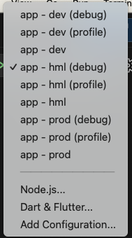

# Guia de Motéis GO - Desafio técnico

[Voltar](/README.md)

## **2. Setup**

Configurações do projeto (quase todas obrigatórias).

### 2.1 FVM

Projeto criado com uso do FVM (Flutter Version Management). **Recomenda-se** sua utilização para a fácil alternância entre versões do Flutter.

Manual de instalação e configuração nas IDEs [aqui.](https://fvm.app/docs/getting_started/installation)

### 2.2 Lefthook

Utilizado para configurar Git Hooks no projeto. Realiza algumas checagens antes de commits ou pushes.

Documentação com manual de instalação [aqui.](https://github.com/evilmartians/lefthook/blob/master/docs)

Após a instalação, acessar a raiz do projeto e executar:

```bash
lefthook install -f
```

### 2.3 Melos

O projeto adotou o uso do [Melos](https://melos.invertase.dev) para simplificar o gerenciamento do repositório, e o gerenciamento de cada Micro App.

Para começar, certifique-se de ter o Melos instalado. Caso ainda não o tenha, você pode instalá-lo utilizando o seguinte comando:

```bash
dart pub global activate melos
```

Após o check-out de uma branch com atualizações, recomenda-se limpar o projeto da seguinte forma:

```bash
melos clean
```

Em seguida, para garantir que as dependências estão corretamente configuradas, utilize o comando:

```bash
melos bootstrap
```

ou simplificadamente:

```bash
melos bs
```

Para obter mais informações sobre comandos úteis disponíveis no Melos, você pode executar:

```bash
melos --help
```

### 2.4 Executando o projeto

Para executar, levar em consideração os flavors `dev`, `hml`, e `prod` (TODO).

Cada flavor possui um arquivo de configurações dentro da pasta `app/.env`.

Executar sempre da seguinte maneira:

```bash
cd app
flutter run -t lib/main-<flavor>.dart --flavor <flavor>
```




### 2.5 Criando/editando flavors

Para a criação dos flavors, foi utilizado o package [flutter_flavorizr](https://github.com/AngeloAvv/flutter_flavorizr).

Seguir sua documentação para adição/edição dos flavors.
