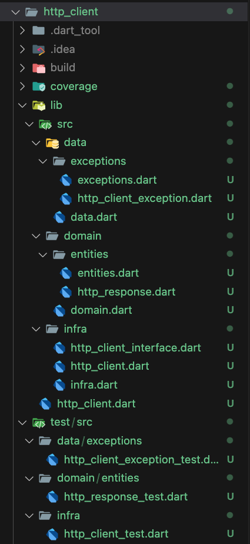
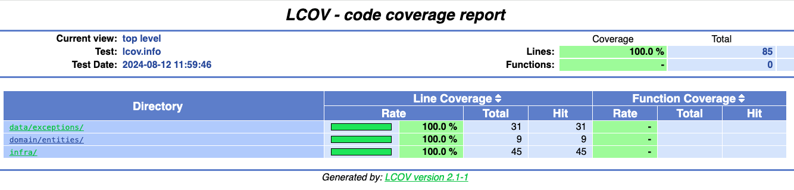

# Guia de Motéis GO - Desafio técnico

[Voltar](/README.md)

## **3. Testes**

Para manter a organização, cada arquivo de teste deve ser criado na mesma estrutura de pastas do arquivo sendo testado. Exemplo:

```bash
# Implementação
/lib
  /domain
    /usecases
      /get_pokemon.dart

# Teste
/test
  /domain
    /usecases
      /get_pokemon_test.dart
```



### 3.1 Padrões

Devem ser seguidos alguns padrões básicos na criação dos testes.

#### 3.1.1 Descrição do teste

Apresentar sempre uma descrição do comportamento esperado do teste.
Como sugestão, pode-se iniciar sempre com `Deve` ou `Não deve`.

Exemplos:

- "Deve apresentar o componente com labels e valores iniciais"
- "Deve disparar evento X ao confirmar form"
- "Não deve permitir confirmação do form enquanto não estiver válido"
- "Deve disparar invalidCredentialsError ao realizar login com dados inválidos"

#### 3.1.2 Organização

Escrever os testes da maneira mais simples e direta possível. Lembrar que muitas vezes um teste será utilizado como "documentação" de uma feature complexa...

Sempre que possível, criar métodos auxiliares dentro do teste ou, se for algo global, no package `test_dependencies`.

Seguir sempre o padrão **AAA** (Arrange, Act e Assert).

- Arrange: Preparação do item sendo testado
- Act: Realiza alguma ação nesse componente para testar diferentes comportamentos
- Assert: Uma ou várias validações em cima do resultado gerado pelo Act

Sempre nomear o objeto sendo testado como `sut` (System Under Test). Essa padronização facilita bastante, visto que em um único arquivo de testes acabamos criando muitas variáveis auxiliares e isso pode acabar confundindo um pouco o leitor sobre o que realmente está sendo testado.

Segue um exemplo utilizando as indicações acima:

```dart
MeuComponente sut;
MyMock meuObjetoMock;

setUp(() {
  meuObjetoMock = createMock(); // Método auxiliar
  sut = createComponentePadrao(); // Método auxiliar
});

testWidgets('Deve disparar o evento X ao confirmar', (tester) async {
  // Arrange do sut
  await tester.pumpWidget(sut);

  // Act
  await tester.tap(find.byType(ConfirmButtonWidget));
  await tester.pump();

  // Assert
  expect(find.byType(CircularProgressIndicator), findsOneWidget);
  verify(meuObjetoMock.eventoX()).called(1);
});
```

### 3.2 Mocks

Para os mocks de classes, será utilizado o [Mocktail](https://pub.dev/packages/mocktail).

Exemplo de criação de mock para a classe `HttpServer`:

```dart
class MockClient extends Mock implements IClient {}

void main() {
  late final MockClient mockClient;
  late final HttpClient httpClient;
  const mockUrl = 'mock://api.jb.dev.br';
  final Uri mockUri = Uri.parse('$mockUrl/list');

  setUpAll(() {
    mockClient = MockClient();
    httpClient = HttpClient(mockUrl, client: mockClient);
    registerFallbackValue(mockUri);
  });

  test('return 200', () async {
    when(
      () => mockClient.get(
        mockUri,
        headers: any(named: 'headers'),
      ),
    ).thenAnswer(
      (_) async => http.Response('{"name": "test"}', 200),
    );

    final result = await httpClient.get('list');

    expect(result, isA<HttpResponse>());
    expect(result.status, 200);
    expect(result.data, {'name': 'test'});

    verify(
      () => mockClient.get(
        mockUri,
        headers: any(named: 'headers'),
      ),
    ).called(1);
    verifyNoMoreInteractions(mockClient);
  });
}
```

### 3.3 Dados para testes

Quando estamos escrevendo testes, muitas vezes precisamos carregar os objetos com algumas informações. Para facilitar isso, foi adicionado ao projeto o package [faker](https://pub.dev/packages/faker).

Exemplo de utilização:

```dart
import 'package:faker/faker.dart';

main() {
  var faker = new Faker();

  faker.internet.email(); // francisco_lebsack@buckridge.com
  faker.internet.ipv6Address(); // 2450:a5bf:7855:8ce9:3693:58db:50bf:a105
  faker.internet.userName(); // fiona-ward
  faker.person.name(); // Fiona Ward
  faker.lorem.sentence(); // Nec nam aliquam sem et
}
```

### 3.4 Cobertura de testes

A cobertura de testes serve para avaliar o quão bem os testes automatizados estão verificando o código-fonte e identificar áreas do código que não estão sendo adequadamente testadas. Isso pode ajudar a garantir que o código seja robusto e livre de erros, e que todas as funcionalidades importantes estejam sendo adequadamente testadas.

Para gerar um relatório com o percentual de cobertura de código basta executar o seguinte comando:

```bash
flutter test --coverage && genhtml -o coverage coverage/lcov.info && open coverage/index.html
```


