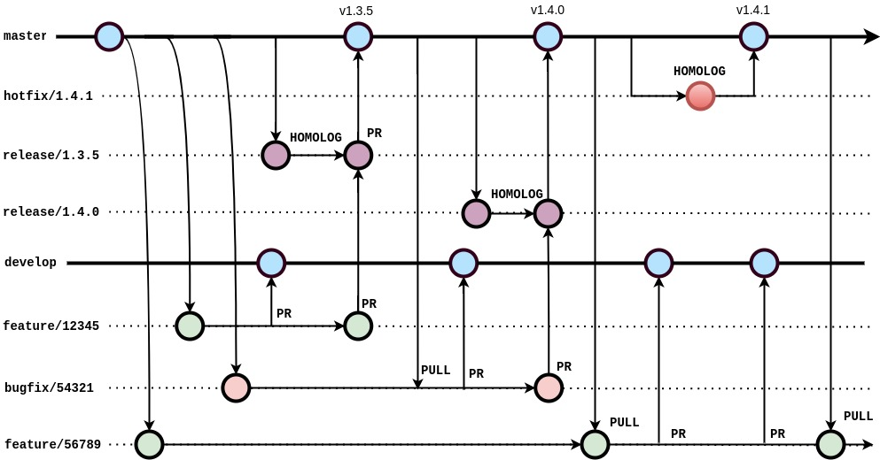

# Guia de Motéis GO - Desafio técnico

[Voltar](/README.md)

## **6. Modelo de versionamento de código**

Objetivando a integridade do código e a qualidade das versões a serem distribuídas, este modelo visa padronizar a nomenclatura das **branches**, mensagens de **commits**, fluxo de **PullRequest**, etc.

### 6.1 branches

- **master**:
Versão do código fonte do software que está em produção;
Todas as branches devem ser criadas a partir dela;
Nenhum commit pode ser realizado diretamente nela;
Somente pode receber merge de branches de release e hotfix;
Após receber merge deve sincronizar a develop.

- **develop**:
Destinada ao pipiline de desenvolvimento;
Branch que reúne implementações dos devs;
Deve conter as implementações de features e bugfixes;
Nenhuma branch deve ser criada a partir dela;
Nenhum commit pode ser realizado diretamente nela.

- **release**:
Branch candidata a ser publicada em produção;
Tem sua origem na master;
Deve ser mergeada com todas as features e bugfixes que seguirão para testes;
Após a versão do software está disponível em produção, deve ser mergeada na master;
Caso alguma funcionalidade não seja aprovada na fase de testes e homologação, a branch deve ser recriada e realizados os merges somente das funcionalidades aprovadas. Não será usado cherry-pick;
Somente poderão ser apagadas após publicação do software em produção.
</br>
*nomenclatura*: release/versão-da-aplicação.
Ex.: release/1.0.0, release/3.5.0
</br>
- **hotfix**:
Bugs emergenciais detectados em produção;
Tem a sua origem na master;
A versão do software será testada, homologada e distribuída à produção;
Após publicação em produção, deve ser mergeada na master;
Somente poderão ser apagadas após publicação do software em produção.
</br>
*nomenclatura*: hotfix/versão-da-aplicação.
Ex.: hotfix/1.0.1, hotfix/3.5.2


- **bugfix**:
Bugs não emergenciais;
Tem a sua origem na master;
Após correção, deve ser mergeada na develop;
Após aprovação, deve ser mergeada na branch de release;
Somente poderão ser apagadas após publicação do software em produção.
</br>
*nomenclatura*: bugfix/numero-do-pbi_descricao-do-pbi.
Ex.: bugfix/3579_login-facebook, bugfix/12345_push-notification-ios
</br>

- **feature**:
Branch de novas funcionalidades;
Deve ter a sua origem na master;
Deve conter correções de bugs encontrados durante as fases de testes e homologação;
Após homologação, deve ser mergeada na branch de release;
Somente poderão ser apagadas após publicação do software em produção.
</br>
*nomenclatura*: feature/numero-do-pbi_descricao-do-pbi.
Ex.: feature/3579_login-linkedin, feature/12345_prova-de-vida
</br>


### 6.2 Versionamento semântico
Considerando a padronização da versão semântica definida como X.Y.Z, onde X,Y e Z são números naturais e não deve conter zero à esquerda, X é a versão maior (MAJOR), Y a versão menor (MINOR) e Z versão de correção (PATCH).

Dado o número da versão como MAIOR.MENOR.PATCH, a sua incrementação seguirá as seguintes regras e condições:
- **Versão maior**: quando houver mudanças incompatíveis na API;
- **Versão menor**: quando adicionar funcionalidades compatíveis com a API;
- **Versão de correção**: correção de bugs mantendo a compatibilidade;

- Cada publicação deve aumentar numericamente o ponto da versão que faz referência. Ex.: 1.3.0, 1.4.0, 1.5.0, 1.5.1;
- Quando a versão menor for incrementada, a versão de correção deverá ser zerada. Ex.: 1.5.7, 1.6.0;
- Quando a versão maior for incrementada, a versão menor e de correção deverão ser zeradas. Ex.: 1.5.7, 2.0.0;
- A versão maior pode ser incrementada se for introduzida uma funcionalidade ou melhoria substancial mesmo mantendo a compatibilidade com a API;
- Quando houver incrementação da versão maior, o software poderá obrigar o usuário a atualizar a sua versão impedindo-o de acessar com a versão incompatível;
- A primeira publicação do software deve ser na versão 1.0.0, logo, as implementações que a antecedem devem ter a versão 0.Y.Z.

Material para estudos: https://semver.org/lang/pt-BR/

</br>
Modelo simples do Gitflow:


</br>
</br>

### 6.3 Pull Request
Após a finalização da implementação da feature, bugfix ou hotfix, deve-se realizar um Pull da branch master com o objetivo de sincronizar a branch com o código mais atualizado. Após atualização do código deve criar uma branch intermediária conforme o caso:

1. **develop**: criar uma branch intermediária com o mesmo nome da branch de feature/fix com o sufixo "_dev" e posteriormente deve ser mergeada com a branch develop.
Ex.: feature\3579_login-linkedin => feature\3579_login-linkedin_dev;
2. **release**: criar uma branch intermediária com o mesmo nome da branch de feature/fix com o sufixo "_rc" e posteriormente deve ser mergeada com a branch de release/hotfix.
Ex.: feature\3579_login-linkedin => feature\3579_login-linkedin_rc.

Após a criação da branch intermediária, deve-se abrir o Pull Request para a branch do caso específico podendo ser develop ou release onde passará pelo Code Review e após aprovação será mergeada.

A branch intermediária somente poderá ser apagada após a publicação do seu código na branch master.

Em todos os casos, sempre que houver Pull Request, o número da build deve ser incrementado.
Ex.: version: 1.0.0+2, 1.1.0+3, 2.0.0+4, etc.

Com o objetivo de manter um histórico das alterações de fácil e rápido entendimento, todos as Pull Requests que serão realizados para as branches de release ou hotfix deverão conter no topo do arquivo CHANGELOG.md a versão que será publicada seguida da lista de PBIs com os respectivos IDs e descrições.

Ex.:
```
# [3.2.0]
* 13579 - Adicionado login de conta Linkedin
* 12357 - Adicionada rotina de prova de vida
* fix [9753] - Correção do login com conta do facebook

# [3.1.6]
* 95876 - Implementação do token de segurança
* 95729 - Adicionada rotina de permissão do uso de câmera
...
```

Ficando:
#### [3.2.0]
* 13579 - Adicionado login de conta Linkedin
* 12357 - Adicionada rotina de prova de vida
* fix [9753] - Correção do login com conta do facebook

#### [3.1.6]
* 95876 - Implementação do token de segurança
* 95729 - Adicionada rotina de permissão do uso de câmera

</br>

### 6.4 Commits

Com o objetivo de facilitar a leitura e entendimento das mensagens dos commits, seguiremos o padrão baseado no **Converntional Commits 1.0.0**. Referência: https://www.conventionalcommits.org/pt-br/v1.0.0/

As mensagens devem seguir o padrão: <**tipo**>**:**<**mensagem**>, sendo:

- **tipo**: refere-se à operação realizada podendo ser:
***build***: alterações de build da aplicação ou suas dependências.
***ci***: alterações em rotinas de integração contínua;
***docs***: alteração na documentação;
***feat***: inclusão de um novo recurso;
***fix***: solução/concerto de problema;
***perf***: alteração no código correspondente a ganho de performance;
***refactor***: alteração no código que não corrige algo ou adiciona recurso;
***style***: alterações visuais;
***test***: implementação ou alteração em testes automatizados.

* **mensagem**: de forma bastante resumida, descrever o contexto do commit. Evitar ultrapassar 50 (cinquenta) caracteres, contanto com o tipo e o separador. Preferencialmente seja escrito em inglês.