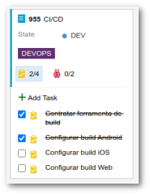

# Guia de Motéis GO - Desafio técnico

[Voltar](/README.md)

## **7. Board**

### 7.1 Acesso
Para acessar o board basta selecionar a opção do menu demonstrada na imagem abaixouo ou pelo link ...:.

### 7.2 Novo item
Para adicionar um novo item, basta clicar no botão "New Item" e selecionar a opção desejada. As opções podem ser:

- **Bug task**: Tarefas de correções;
- **Débito Técnico**: Melhorias de implementação;
- **Product Backlog Item**: Novas funcionalidades.

### 7.3 O board

Os itens são iniciadas na primeira fase e finalizadas na última. As tarefas devem ser movidas de forma unidirecional para a coluna da direita.  As fases inicialmente elaboradas são:
- **REFINAMENTO**: Existe a necessidade da tarefa e a mesma encontra-se na fase de discussão para entendimento de todos os envolvidos. Em geral, a tarefa é discutida em reunião;
- **PRONTO PARA DEV**: Após o entendimento da tarefa, a mesma fica disponível para iniciar a sua implementação;
- **EM DESENVOLVIMENTO**: Momento em que o profissional começa a sua implementação;
- **PRONTO PARA TESTES**: Assim que o profissional finaliza a sua implementação, a tarefa deve ficar disponível para o time de QA iniciar os testes funcionais;
- **EM TESTE**: Ao iniciar a fase de testes, a tarefa deve ser movida para esta coluna;
- **HOMOLOGAÇÃO**: Com os testes finalizadas, a tarefa fica pronta para ser homologada executando testes regressivos;
- **AGUARDANDO DEPLOY**: A tarefa sendo aprovada pela fase de testes, fica disponível para a sua disponibilização;
- **PUBLICADO**: A tarefa completou o seu ciclo de implementação.

### 7.4 Escopo do item
Ao criar um novo item, deve-se informar o escopo da(s) plataforma(s) no campo de **tag** sendo:
- DEVOPS;

- INFRA;

- BACK;

- DESIGN;

- APP;

- WEB.

### 7.5 Conteúdo do item
Os itens podem conter diversas tasks e/ou bugs e devem ser marcados como finalizados à medida da sua conclusão.

### 7.6 Tarefa bloqueada
Quando a continuidade da implementação da tarefa for impossibilitada por qualquer motivo, mas mesma deverá ter o "flag" de "IMPEDIMENTO" marcado ficando a mesma com destaque no board.

### 7.7 Links de Pull Requests
Quando houver alteração em códigos fonte, o link das PRs tanto para "develop" como para "release" devem ser anexados ao item.